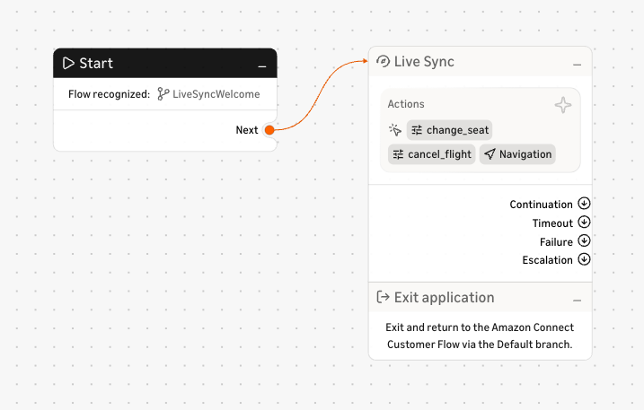

# Touchpoint

Touchpoint is a drop-in conversational UI and SDK for Amazon Connect Customer — a
single widget for chat, voice, and voice-mini, plus **Live Sync**, the
native technology that keeps a voice or chat conversation in sync with your
on-screen interface.

```bash
npm i @amazon-connect-touchpoint/web
```

## Prerequisites

To run Touchpoint you need an Amazon Connect Customer instance with a contact
flow, plus a browser-facing endpoint that mints the contact credentials. Gather
the following before you call `create()`:

| What you need | Where it comes from |
| --- | --- |
| **StartChatContact endpoint** (chat) | An API Gateway/Lambda route that calls Amazon Connect's `StartChatContact` and returns participant credentials. Deploy the [StartChatContact API](https://github.com/amazon-connect/amazon-connect-chat-ui-examples/tree/master/cloudformationTemplates/startChatContactAPI). Required for `input: "text"`. Passed as `config.chatEndpoint`. |
| **StartWebRTCContact endpoint** (voice) | An endpoint that calls `StartWebRTCContact` and returns the Chime connection data. Deploy the [StartWebRTCContact sample](https://github.com/amazon-connect/amazon-connect-in-app-calling-examples/tree/main/Backend/AmazonConnectNetraApiSample). Required for `input: "voice"` and `input: "voiceMini"`. Passed as `config.voiceEndpoint`. |
| **Instance ID** | The Amazon Connect Customer instance (UUID) the contact is created in. `config.instanceId`. |
| **Contact Flow ID** | The contact flow (UUID) that handles the contact. `config.contactFlowId`. |
| **Region** | AWS region of your instance, e.g. `us-west-2`. `config.region`. |

That's everything you need for chat and voice. **Live Sync is optional** — it
additionally requires an Agentic CX designer (ACXD) application; see below.

### Setting up Amazon Connect Customer

1. **Create a contact flow** in your Amazon Connect Customer instance that
   handles the contact; note the **instance ID** and **contact flow ID**.
2. **Stand up the browser endpoints** so the page can create a contact — the
   [StartChatContact](https://github.com/amazon-connect/amazon-connect-chat-ui-examples/tree/master/cloudformationTemplates/startChatContactAPI)
   (chat) and
   [StartWebRTCContact](https://github.com/amazon-connect/amazon-connect-in-app-calling-examples/tree/main/Backend/AmazonConnectNetraApiSample)
   (voice) endpoints above.

### Adding Live Sync (optional)

Live Sync keeps the conversation in sync with your on-screen interface. It's the
only feature that requires ACXD; plain chat and voice work without it. To enable
it:

1. **Build the ACXD application.** In the ACXD Canvas, wire `Start` → a
   **Live Sync** node → `Exit application`. On the Live Sync node, declare the
   actions and scopes the assistant may use (or define them on the fly with this
   SDK for rapid prototyping — see [Live Sync](#live-sync) below).

   

2. **Publish it and copy your keys.** Deploy the application, then copy the
   **deployment key** and **API key** from its settings.
3. **Route your contact flow into it** so contacts reach the ACXD application,
   and pass the keys as `liveSync.deploymentKey` / `liveSync.apiKey`.

The [interactive playground](#interactive-playground) lets you plug these values
into a form and launch a live instance without writing any code.

## Examples

### Chat

```js
import { create } from "@amazon-connect-touchpoint/web";

const touchpoint = await create({
  config: {
    // Your StartChatContact endpoint (e.g. an API Gateway route) that mints a
    // participant token.
    chatEndpoint: "REPLACE_WITH_START_CHAT_ENDPOINT",
    instanceId: "REPLACE_WITH_INSTANCE_ID",
    contactFlowId: "REPLACE_WITH_CONTACT_FLOW_ID",
    region: "us-east-1",
  },
  input: "text",
});
```

### Voice mini

A compact, floating voice widget. Voice modes connect through your
`StartWebRTCContact` endpoint. On mobile it stacks vertically, and a drag handle
lets the customer move it out of the way of the page.

```js
import { create } from "@amazon-connect-touchpoint/web";

const touchpoint = await create({
  config: {
    voiceEndpoint: "REPLACE_WITH_START_WEBRTC_ENDPOINT",
    instanceId: "REPLACE_WITH_INSTANCE_ID",
    contactFlowId: "REPLACE_WITH_CONTACT_FLOW_ID",
    region: "us-east-1",
  },
  input: "voiceMini", // or "voice" for the full-screen experience
});
```

### Layouts

`windowSize` controls how the expanded experience is presented (applies to chat
and full-screen voice; `voiceMini` is always a compact floating widget):

- `half` _(default)_ — overlay with the panel on the right and the rest of the
  page dimmed.
- `full` — overlay covering the whole viewport.
- `floating` — a detached, rounded panel that hovers over the page without
  dimming it, so the site stays visible and interactive.
- `side-by-side` — a panel docked to the right edge for the full height; on wider
  viewports the page is narrowed by the panel's width so nothing is hidden behind
  it and both can be used at once.

`floating` and `side-by-side` are ideal for chatting while browsing — the way
voice conversations already run alongside the page.

```js
const touchpoint = await create({
  config: {
    /* … */
  },
  input: "text",
  windowSize: "side-by-side",
});
```

### Theming

Pass a partial `theme` to match your brand. The **accent** color drives prominent
elements — the send button, loader, selected states, and the voice
audio-signaling ripple — and defaults to black/white so setting a brand accent is
immediately visible. A contrasting foreground on the accent (e.g. the send arrow)
is derived automatically.

```js
const touchpoint = await create({
  config: {
    /* … */
  },
  theme: {
    accent: "#22c55e",
    // Optional overrides: primary, secondary, background, fontFamily, …
  },
});
```

### Live Sync

Live Sync is native Amazon Connect Customer technology that synchronizes
a voice (or chat) conversation with a digital, on-screen interface. Customers see
options, next steps, and confirmations in real time while an AI agent guides them
— no app, no channel switch — unlocking complex, multi-step tasks that voice or
chat alone can't handle, where customers need to see, choose, and complete actions
in a single continuous conversation.

In Touchpoint, the AI agent drives the page through **custom actions**: you
register a named action with a JSON Schema, the agent resolves what the customer
said into typed arguments, and your handler applies them to the page.

```js
import { create } from "@amazon-connect-touchpoint/web";

const touchpoint = await create({
  config: {
    chatEndpoint: "REPLACE_WITH_START_CHAT_ENDPOINT",
    instanceId: "REPLACE_WITH_INSTANCE_ID",
    contactFlowId: "REPLACE_WITH_CONTACT_FLOW_ID",
    region: "us-east-1",
  },
  input: "voiceMini",
  liveSync: {
    deploymentKey: "REPLACE_WITH_DEPLOYMENT_KEY",
    apiKey: "REPLACE_WITH_API_KEY",
    // `contactId` is optional — defaults to the active session's contact. Set it
    // to bind a separate contact (e.g. an inbound phone call) to this page.
  },
});

// Advertise the actions the AI agent may take (sent once a contact exists):
await touchpoint.sendContext({
  actions: [
    {
      action: "set_cabin_class",
      description: "Choose the cabin class",
      schema: {
        type: "object",
        properties: {
          cabin: { type: "string", enum: ["economy", "business", "first"] },
        },
        required: ["cabin"],
      },
      handler: ({ cabin }) => setCabinClass(cabin),
    },
  ],
});
```

Actions can also be configured in
[Agentic CX designer (ACXD)](https://docs.aws.amazon.com/connect/latest/adminguide/acxd.html)
on the Live Sync node; defining them here is useful for rapid prototyping. To
notify a Live Sync script that the user reached a step, call
`touchpoint.sendStep({ stepId, scriptId, apiKey, context })`.

### External (no UI)

Use `input: "external"` to run Touchpoint with **no rendered UI**. It opens no
chat or voice contact of its own — it only connects Live Sync to an existing
live contact (identified by `liveSync.contactId`) so that contact can drive your
digital asset in real time. A common case is a **phone call**: the caller talks
to the agent while the page updates alongside them. No `chatEndpoint` or
`voiceEndpoint` is needed; only the Live Sync credentials.

```js
import { create } from "@amazon-connect-touchpoint/web";

const touchpoint = await create({
  config: { region: "us-east-1" },
  input: "external",
  liveSync: {
    deploymentKey: "REPLACE_WITH_DEPLOYMENT_KEY",
    apiKey: "REPLACE_WITH_API_KEY",
    contactId: "REPLACE_WITH_CONTACT_ID", // the contact to sync with
  },
});

// Advertise your actions, then drive the page as the agent invokes them.
await touchpoint.sendContext({ actions: [/* … */] });
```

## Interactive playground

Running the project locally launches an interactive playground covering every
capability (chat, voice, voice-mini, and Live Sync):

```bash
npm install
npm run dev
# then open http://localhost:5173
```

## API reference

The full SDK specification — every configuration option, type, and modality
component — is generated from source and lives under
**[`docs/`](./docs/README.md)**.

Common entry points:

- [`create(config)`](./docs/README.md) — create and mount a Touchpoint instance.
- `TouchpointConfiguration` — top-level options (`config`, `input`, `colorMode`,
  `windowSize`, `theme`, `liveSync`, …).
- `ConnectConfig` — Amazon Connect Customer connection details.
- `LiveSyncConnection` / `LiveSyncContextInput` — Live Sync connection and the
  actions / scopes / destinations you advertise to the AI agent.


## Embedded mode

Touchpoint also registers a custom element called `<connect-touchpoint>`, which you can include in your UI. This element has a writeable property `touchpointConfiguration` that accepts the same input as [`create`](#create).

This starts Touchpoint in embedded mode, in which there is no open button and Touchpoint will fit into any container you make available for it, making it easier to integrate into various page layouts.

A simple code snippet for embedded mode:

```html
<div class="my-grid-layout">
  <main>
    <!-- Main page content -->    
  </main>
  <aside>
    <connect-touchpoint/>
  </aside>
</div>
<script>
  const touchpointElement = document.querySelector("connect-touchpoint");
  touchpointElement.touchpointConfiguration = {
    config: {
      // Your StartChatContact endpoint (e.g. an API Gateway route) that mints a
      // participant token.
      chatEndpoint: "REPLACE_WITH_START_CHAT_ENDPOINT",
      instanceId: "REPLACE_WITH_INSTANCE_ID",
      contactFlowId: "REPLACE_WITH_CONTACT_FLOW_ID",
      region: "us-east-1",
    },
    input: "text",
  };
</script>
```

Since it is a custom element, it by default isn't a block element, so you may want to give it:

```css
connect-touchpoint {
  display: block;
  height: 100%;
}
```

or similar styling.

## License

[MIT](./LICENSE)
